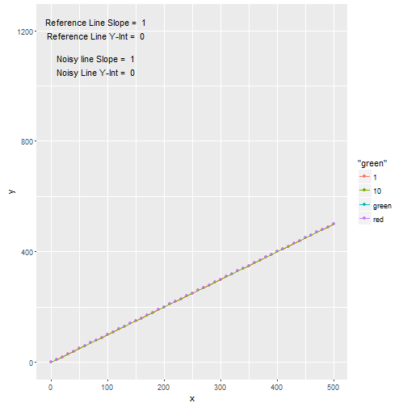
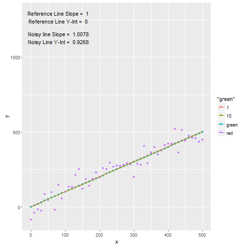
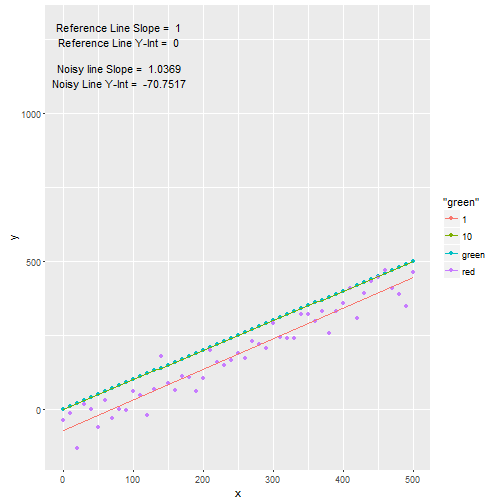
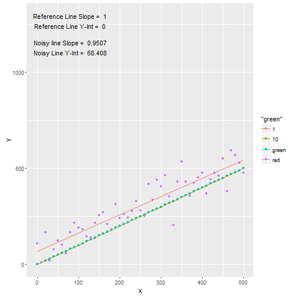
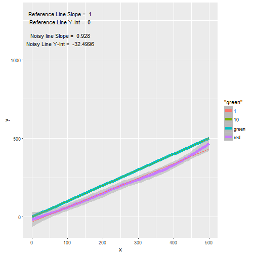
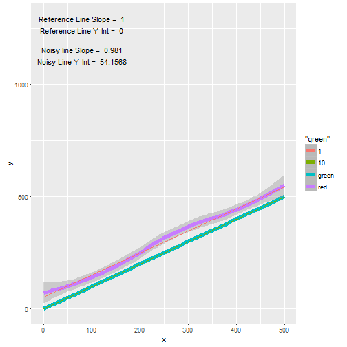
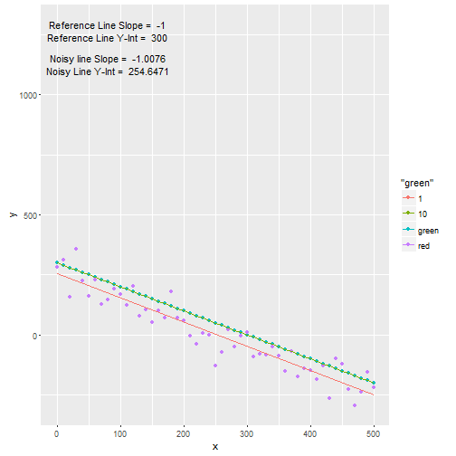
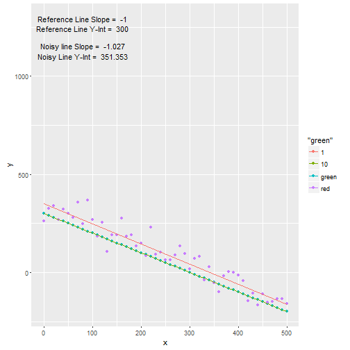
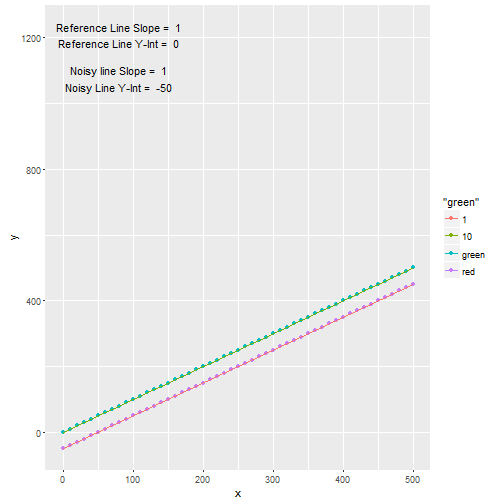
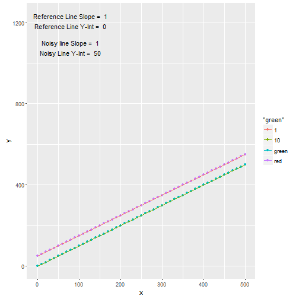

--- 
title       : Interactive Noise/Error Manipulation 
subtitle    : An "Interactive Shiny Project" Presentation Pitch
author      : dd1947in
job         : 
framework   : io2012        # {io2012, html5slides, shower, dzslides, ...}
highlighter : highlight.js  # {highlight.js, prettify, highlight}
hitheme     : tomorrow      # 
widgets     : []            # {mathjax, quiz, bootstrap}
mode        : selfcontained # {standalone, draft}
knit        : slidify::knit2slides
---bg:url(assets/fig/shiny_proj.png)

---   

## A Very Brief Description  
  One can study and get better in any subject  with the use of interactive applications . Interactive applications are very important tools to demonstrate  products and ideas to a wider audience.   This presentation is submitted to pitch an "Interactive Shiny Project".  
  
   The following slides show a a list of plots  that are generated in "Interactive Shiny Project"  that accompany these project pitch  slides .  The following methodology  is followed in the design of the "Interactive Shiny Project".  

1. Points (x, y)   on a reference line  y = s1 * x + c1  are generated for a given slope and intercept. 
2. Points (x, y)  on a noisy line yo = y + random_normal_error(mean_err, sd_err)  are generated  for a given mean and sd .  
3. A linear regression model  is fit through reference line and noisy line . 
4. User is given Plot options  of Points  and Line/Smooth. 
5. User can manipultate slope, intercept, mean of error, sd of error and create new plots .
6. User can study the effects of various parameters on the  reference and noisy lines . 

--- .class #id 

### Plot 1 : Beta = 1; Y-int = 0; Mean = 0; SD = 0 ; Type = point

---  

### Plot 2 : Beta = 1; Y-int = 0; Mean = 0; SD = 50 ; Type = point

---  

### Plot 3 : Beta = 1; Y-int = 0; Mean = -50; SD = 50 ; Type = point

---  

### Plot 4 : Beta = 1; Y-int = 0; Mean = 50; SD = 50 ; Type = point

---  

### Plot 5 : Beta = 1; Y-int = 0; Mean = -50; SD = 50 ; Type = line/smooth  
  

---   
    

### Plot 6 : Beta = 1; Y-int = 0; Mean = 50; SD = 50 ; Type = line/smooth  
  
  

---  

### Plot 7 : Beta = -1; Y-int = 0; Mean = 0; SD = 0 ; Type = point  
  

---  

### Plot 8 : Beta = -1; Y-int = 300; Mean = 50; SD = 50 ; Type = point  
     

---   
   
   
### Plot 9 : Beta = 1; Y-int = 0; Mean = -50; SD = 0 ; Type = point  
   
   

---     
   
### Plot 10 : Beta = 1; Y-int = 0; Mean = 50; SD = 0 ; Type = point  
  

